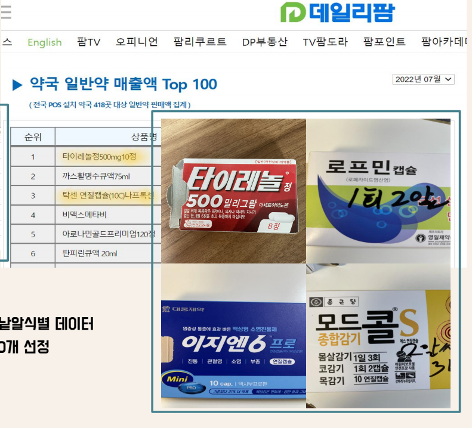
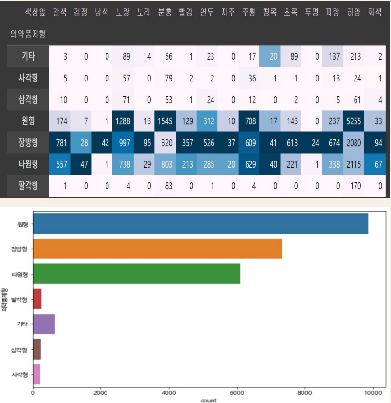

# 그게뭐약 :pill:

딥러닝 활용 알약 식별 프로젝트

 

## 1. 프로젝트 개요

:point_right: 약 봉지 또는 케이스가 없어 무슨 약인지 모를 때! 어떤 약인지 정보를 쉽게 확인하여 오용하지 않도록 하기 위함. 

:point_right: 최종 목적은 정확한 상황에 정확한 약을 쓰기 위함.

:point_right: 알약 사진을 촬영하여 어떤 알약인지 판별해 내는 프로젝트

 

 

-----

## 2. 데이터 수집

- 공공 데이터 - 의약품 낱알식별 데이터
  - 공공 데이터에서 얻은 이미지 파일은 실제 일상에서 찍은 사진과 달리 최상의 상태로 깔끔하게 찍은 클린 이미지
  - 따라서 실제 이미지를 찍을 필요가 있었음
- 매출액 Top 100 기준으로 시중에서 쉽게 구할 수 있는 알약 10개를 선정하여 약국에서 구입한 후 실제 이미지 수집
  - 대표 알약 선정하는 데 약사 도움 받음

 

 

-------

## 3. EDA

- 원형 : 9872

- 장방형 : 7318

- 타원형 : 6104

 	→ 가장 많은 종류인 원형, 장방형 중심으로

 

계획

1. 알약 모양을 기준으로 데이터 선택

2. 같은 모양일 때는 색깔별로 2차 분류 가능

3. 글자에 새겨진 음각을 식별

 

 

------

## 4. 진행 방법

1. **Labeling**
   - labelImg 툴을 이용한 라벨링 
   - 작업사진 안의 알약 하나하나 RectBox로 드래그 한 후 라벨링 작업작업 후 class와 좌표 정보가 담긴 txt 파일 생성

2. **Image Augmentation**
   - ImgAug 라이브러리를 이용한 데이터 증강
   - ImgAug 라이브러리를 사용하기 위해 txt 파일이 아닌 xml 파일로 변환 필요성 발견
   - 기존에 확보한 txt 파일을 → xml 파일로 변환되는 코드 작성❗
   - xml 파일을 이용해 ImgAug 라이브러리 안의 여러 효과들 적용

 

 

------

## 5. 데이터 준비

- 직접 촬영한 이미지를 프리웨어 소프트웨어를 통해 png로 변환, 리사이즈, 150*150으로 자르고, 라벨링을 하고, 파일명을 순서대로 일괄 변경
- 그리고 각 약 별로 배경을 제거하고, 이미지를 증강하고, 파일 경로와 xml 파일 안에서의 한글 문제, utf-8 인코딩 문제, png의 알파 채널 문제 등을 처리하기 위해 파이썬으로 별도 프로그램을 작성해서, 추가 촬영 시 언제든지 데이터를 준비 할 수 있도록 자동화
- 총 data : 24000

 

 

----

## 6. 모델링

### 1) Faster RCNN

- CNN을 기반으로 한 객체 검출 알고리즘

- RPN(Region Proposal Network)과 컨볼루션 맵 공유하여 객체 검출

- 1) 픽셀을 균등하게 처리 (커널을 동일한 사이즈)

  2) 10개의 이미지 (클래스)를 가지고 먼저 학습 후 성능 파악

  3) 클래스 10개 - 에폭 20 - 데이터 2400개씩 -> 학습할 때 까지 12 시간 소요

- **mAP = 0.899**

 

 

### 2) YOLO v5

- 1) 픽셀을 균등하게 처리 (커널을 동일한 사이즈)
  2) train : valid : test = 7 : 2 : 1
  3) 클래스 10개 - 에폭 100 -> 학습할 때 까지 6시간 소요

- **mAP : 0.995**

 

 

----

## 7. 결론

1. 알약 식별을 위한 Object Detection 모델인 Faster RCNN과 YOLO v5를 구현

2. 알약의 종류를 빠르게보단 정확하게 알아내는 것이 목표  -> Faster RCNN이 적합하다는 결론을 내림

3. 아쉬운 점.세미 프로젝트 특성상 시간 부족으로 10개의 알약만 class로 사용서비스 개발 단계까지 가지 못함